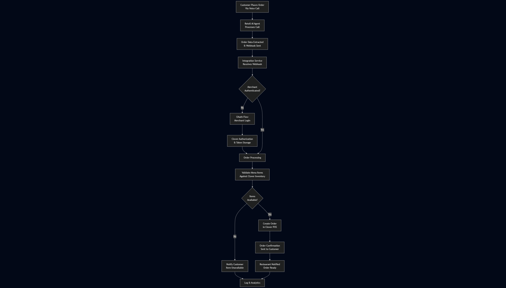

# Clover-Retell Integration Service

I've been working on this integration that connects Retell AI voice agents to Clover POS systems. Basically, customers can call a restaurant and place orders through a voice AI, and those orders automatically get pushed into the restaurant's Clover system.

## What This Does

I built this because there was this gap where restaurants wanted to use AI voice ordering but couldn't easily connect it to their existing POS systems. Most places already use Clover for their day-to-day operations, so I wanted something that would work with what they already have.
Current no-code tools like Make.com for automations have a pretty average integration system with Clover where half the time is spent debugging what access-token they require to mititage the 401 error.

The whole thing works as middleware - it sits between Retell AI and Clover, handling the authentication with merchants and making sure orders flow through properly.

## How It Works



There are two main parts to this:

**Clover Side**: I handle all the OAuth stuff with Clover so merchants can connect their POS system. Once they're authenticated, I manage their tokens and keep them refreshed automatically. No one wants to deal with expired tokens in the middle of dinner rush.

**Retell AI Side**: This is where the magic happens. When someone finishes a call with the AI agent, Retell sends me a webhook. I grab the call data, extract all the order details (customer name, items, quantities, etc.), and format it for Clover.

## Main Features

**OAuth Setup**: I've got the full OAuth 2.0 flow working with Clover. Merchants log in once, and I handle all the token stuff behind the scenes.

**Voice Order Extraction**: Takes the natural language from Retell calls and turns it into structured order data. Works pretty well even when customers change their minds mid-order.

**Real-time Processing**: As soon as a call ends, I get a webhook and can process the order immediately. No delays.

**Web Portal**: Built a simple portal where restaurant owners can connect their Clover account and test things out. Makes onboarding way easier.

**Cloud Ready**: Set this up to deploy easily on Render or similar platforms. Environment variables handle all the config.

**Error Recovery**: Added retry logic and proper error handling because APIs fail sometimes and you don't want to lose orders.

## Getting This Running

### What You Need

To get this working, you'll need:

- Node.js 18+ (I'm using 20.x in production)
- Clover developer account - you'll need to create an app to get credentials
- Retell AI account with API access
- Somewhere to host it (I'm using Render but Heroku works too)

### Setting Up Environment

Make a `.env` file with your credentials:

```
BASE_URL=https://your-service-domain.com
CLOVER_ENV=sandbox
CLOVER_APP_ID=your_clover_app_id
CLOVER_APP_SECRET=your_clover_app_secret
RETELL_API_KEY=your_retell_api_key
STATE_SECRET=your_random_state_secret
PORT=3000
```

### Running Locally

Standard Node.js setup:

```bash
npm install
npm run dev
```

Check if it's working:
```bash
curl http://localhost:3000/health
```

The merchant portal is at `http://localhost:3000/portal` - that's where restaurants can connect their Clover accounts.

## OAuth Flow (The Tricky Part)

Getting the OAuth flow right took some time, but here's how it works:

1. **Restaurant Signs Up**: They fill out a form on my portal
2. **Redirect to Clover**: I send them to Clover's auth page where they log in
3. **Permission Grant**: They approve access for orders and inventory
4. **Get Tokens**: Clover sends back an auth code, I exchange it for tokens
5. **Token Management**: I store the tokens and refresh them automatically

I added CSRF protection with signed state parameters because security matters. Works with both Clover's sandbox and production environments.

## Working with Retell AI

### Getting Call Data

I connect to Retell through their REST API to grab call information:

```javascript
// Extract order details from a completed call
const response = await fetch('/api/calls/call_abc123/extract-variables', {
  method: 'POST',
  headers: { 'Content-Type': 'application/json' },
  body: JSON.stringify({
    variableNames: ['customer_name', 'phone_number', 'order_items', 'total_amount', 'payment_method']
  })
});
```

### Webhook Handling

The real-time webhooks are pretty straightforward:

- When a call ends, Retell hits my webhook endpoint
- I extract the order details from the transcript
- If something goes wrong, I log it and can alert the restaurant

## API Endpoints

### For Merchants

**Portal**: `GET /portal` - The main page where restaurants can sign up and connect

**OAuth Callback**: `GET /oauth/callback` - Where Clover sends people back after they authorize

**Connect Account**: `POST /portal/connect/:tenantId` - Starts the OAuth flow

### For Retell

**Get Call Info**: `GET /api/calls/:callId` - Pulls all the call data and transcript

**Extract Variables**: `POST /api/calls/:callId/extract-variables` - Gets specific order details from the call

**List Agent Calls**: `GET /api/agents/:agentId/calls` - Shows all calls for an agent

**Webhook**: `POST /webhook/call-events` - Where Retell sends call completion events

### For Testing Clover

**Merchant Details**: `GET /portal/api/me/:tenantId` - Basic merchant info from Clover

**Menu Items**: `GET /portal/api/items/:tenantId` - Gets the restaurant's inventory from Clover

## How an Order Flows Through

1. **Customer Calls**: They talk to the Retell AI agent like it's a human
2. **AI Takes Order**: The agent captures everything - items, quantities, special requests
3. **I Get Notified**: Retell sends me a webhook when the call ends
4. **Extract & Validate**: I pull out the order details and check them against the restaurant's menu
5. **Push to Clover**: If everything looks good, I create the order in their POS
6. **Everyone's Happy**: Customer gets confirmation, restaurant sees the order in their system

## Security Stuff

I tried to cover the important security bases:

**Token Handling**: OAuth tokens are stored safely and refreshed automatically when they expire

**CSRF Protection**: Using signed state parameters in the OAuth flow to prevent attacks

**Input Validation**: Everything gets validated before I process it

**HTTPS Only**: Production requires HTTPS because we're dealing with payment data

**Clean Errors**: Error messages don't leak sensitive information

## Deploying This Thing

### Cloud Setup

I built this to be easy to deploy:

1. **Connect Repo**: Link your Git repo to Render/Heroku/whatever
2. **Set Environment**: Add all those environment variables in the dashboard
3. **Build Commands**: `npm install` for build, `npm start` for production
4. **Domain**: Set up your domain and SSL (super important for OAuth)

### Environment Variables

| Variable | Description | Required |
|----------|-------------|----------|
| `BASE_URL` | Your public service URL | Yes |
| `CLOVER_ENV` | Clover environment (sandbox/prod) | Yes |
| `CLOVER_APP_ID` | Clover application ID | Yes |
| `CLOVER_APP_SECRET` | Clover application secret | Yes |
| `RETELL_API_KEY` | Retell AI API key | Yes |
| `STATE_SECRET` | Random secret for OAuth state signing | Yes |
| `PORT` | Server port (default: 3000) | No |

### Production Notes

A few things to remember for production:

- HTTPS is required (OAuth won't work without it)
- Set up proper logging - you'll want to debug issues
- Replace the file-based storage with a real database
- Add rate limiting so people can't spam your APIs
- Configure CORS properly for your domain

## Error Handling

I spent time making sure this doesn't just crash when things go wrong:

**API Errors**: Proper HTTP status codes and error messages

**OAuth Issues**: If authorization fails, users get helpful messages instead of cryptic errors

**Token Problems**: If tokens expire or refresh fails, I handle it gracefully

**Webhook Validation**: I verify webhook signatures so random people can't fake orders

## Logging

I log the important stuff:

- When OAuth flows complete or fail
- API request patterns and how long things take
- Errors and system health
- Webhook processing status

## TODO / Future Ideas

Some things I want to add eventually:

- **Real Database**: Replace the JSON file storage with PostgreSQL or something
- **Multi-location**: Support for restaurant chains with multiple locations
- **Analytics**: Track order patterns and give restaurants insights
- **Mobile App**: Maybe build a companion app for restaurant managers
- **Payment Integration**: Handle payments directly instead of just order info

## Useful Links

If you're working on something similar:

- **Clover Docs**: [Clover REST API Documentation](https://docs.clover.com/docs)
- **Retell AI Docs**: [Retell AI API Reference](https://docs.retellai.com/)
- **OAuth 2.0 Spec**: [RFC 6749](https://tools.ietf.org/html/rfc6749) (if you really want to dive deep)

## Notes

This whole project came from wanting to help small restaurants compete with the big chains that have fancy ordering systems. The idea is that any restaurant using Clover can now offer AI voice ordering without changing their workflow. Pretty cool to see technology making things more accessible rather than just more complicated. 